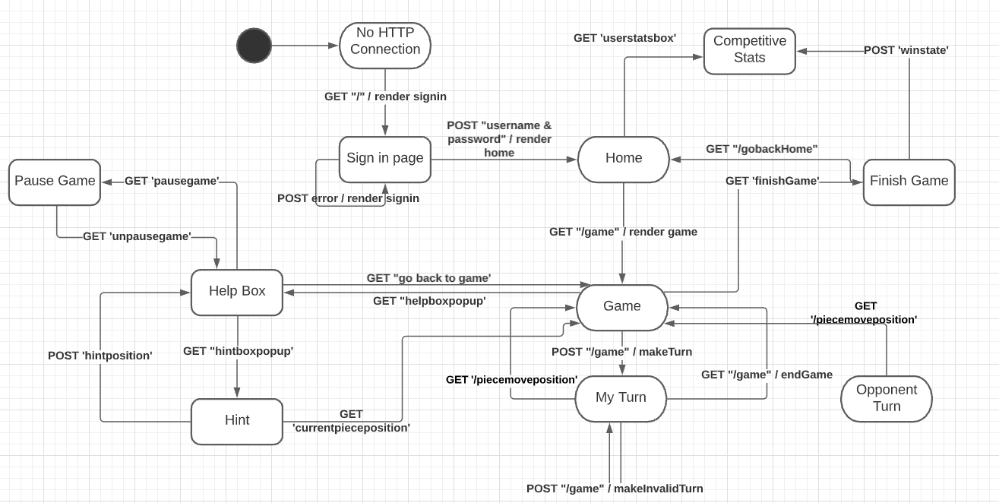
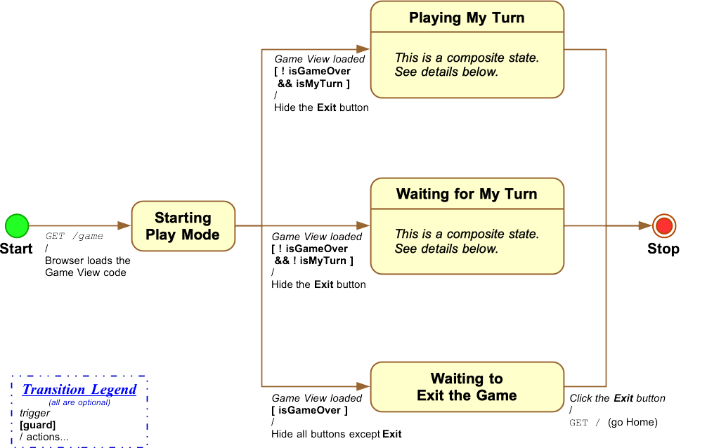
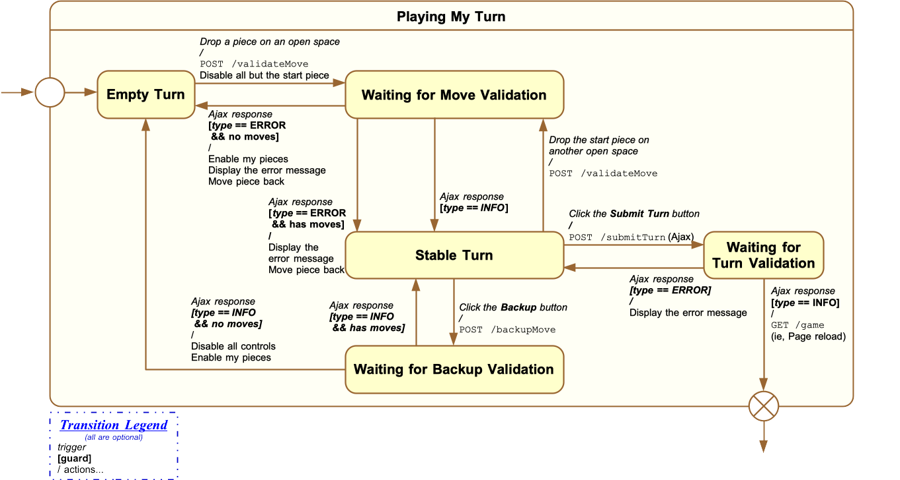
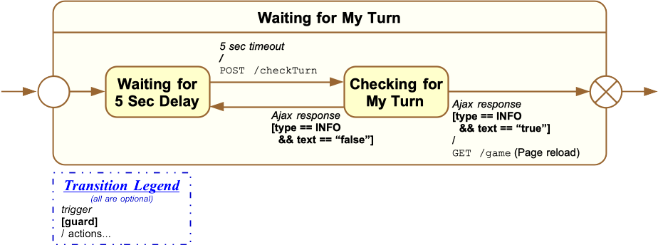
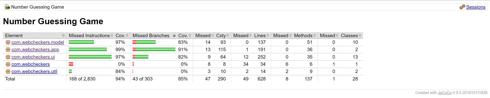
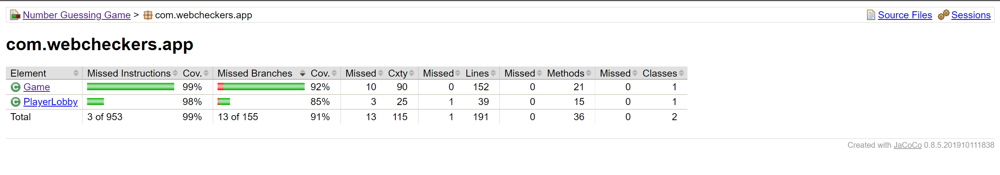
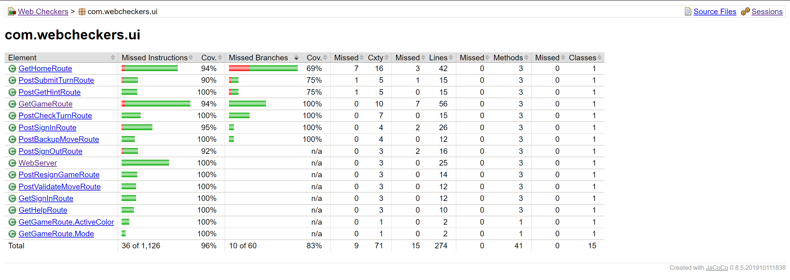

# PROJECT Design Documentation

## Team Information
* Team name: Team Rhamz
* Team members
  * Anh Nguyen
  * Rhamsez Thevenin
  * Sierra Tran
  * Phil Ganem
  * Mohammed Alam

## Executive Summary
WebCheckers is an application that users can sign in to play online Checkers
with other players. Using the Spark framework for Java, WebCheckers
provides users with a realtime experience challenging an opponent.

### Purpose
This project is a web-application of checkers. 
Users should be able to log-in, and play against other players.

### Glossary and Acronyms

| Term | Definition |
|------|------------|
| UI | User Interface |
| POJOs | Plain Old Java Objects |
| MVP | Minimal Viable Product |

## Requirements

This section describes the features of the application.

### Definition of MVP
1. Every player must sign-in before playing a game, and be able 
   to sign-out when finished playing.
2. Two players must be able to play a game of checkers based upon 
   the American rules.
3. Either player of a game may choose to resign, at any point, 
   which ends the game.

### MVP Features
- Sign In
- Start a Game
- Make Moves
- Win/Lose the Game
- Resign

### Roadmap of Enhancements
1. Player Help
2. Tournament Play

## Application Domain

This section describes the application domain.

The domain highlights the general flow of the application:
- The user signs in to be at the home page (menu)
  
- The user can then start a game (becoming a Player) or check player stats 
  for competitive mode
  
- The player can make a move to play the game
  
- The move communicates with the model which includes
  the Board, Row, Space, and Pieces
  
- The player plays the game

The most important entities of the domain model are the Player, Board, Row, 
Space, and Piece entities.

- Each set of 24 checker Pieces on the board represents a Player in the
  game. Players take a turn when they make a move which is played with
  Checkers which are on the board.
  
- Regular or King Pieces are on specific Spaces which belong to Rows which also
  builds the entire Board. In short, there can be zero or one Piece on each Space,
  there are 8 Spaces on each Row, and there are 8 Rows on a board.

## Architecture and Design

This section describes the application architecture.

### Summary

The following Tiers/Layers model shows a high-level view of the webapp's architecture.

As a web application, the user interacts with the system using a
browser.  The client-side of the UI is composed of HTML pages witharchi
some minimal CSS for styling the page.  There is also some JavaScript
that has been provided to the team by the architect.

The server-side tiers include the UI Tier that is composed of UI Controllers and Views.
Controllers are built using the Spark framework and View are built using the FreeMarker framework.  The Application and Model tiers are built using plain-old Java objects (POJOs).

Details of the components within these tiers are supplied below.

### Overview of User Interface

This section describes the web interface flow; this is how the user views and interacts
with the WebCheckers application.

So we start with our initial condition if the GET request doesn't render the page correctly. We then load on the sign-in page with GET "/" render sign-in. The sign-in page state was initially made with a piece of account information in mind, so if the user doesn't enter the right password, we would get the sign-in page again for them to input their information once again. 

The player is redirected to home once they successfully sign in, and the Post will send their info to check if sign-in is correct. Once in the home page state, the User will have options such as a button that will make a get request for a page that will display the user's stats. 

On the Home page, there will be an option to click the other player's button and be redirected into a game using the GET "/game request". In the game state, you will have several requests and options. 

Here in the Game state, you can make Post requests that will try to move checker pieces. You will have a GET request to update the board on your UI based on the board class, and we will be posting information such as the space you moved to. Based on whether or not it's your turn, your opponent will still be playing and modifying the board so we will have GET requests to update the Board as such from the Opponent's turn state. 

There is also a Help Menu state on the game, where you can pause your game and go into the Help Menu state which you access with a GET request. In that state, you can open another state called Pause game which will allow you to pause the game if you ever need to take a break. This is done by a GET request to the pause state and another back to the help menu state. Another option from the Help Menu is the Hint state. If you're stuck on Checkers, a Hint will be shown to help you decide your next move. We will be sending a GET request for the Hint state, and from the Hint state we will be Posting information, or in our case, the Hint the player can do. After that, we can close Hint by doing another Get request of the Help Menu, and another Get request to go back to our game will be played. 

So now we are playing the game and repeating the aforementioned requests. We now end up to where the game is finished. When the Game is finished we GET the Game Finished State, which is basically a screen showing the game has stopped and whatever the result is, then we POST information about the players into the Competitive stats page state that was mentioned before. This will update their wins/losses and other details. This can always be accessed back on the Home page. In the Finished game screen state, you have the option of wanting to go back home or directly to the user stats page. 

### UI Tier

The UI-tier components of the WebCheckers application are all controlled
by the WebServer class. It handles all GET and POST requests. All other
classes in the `ui` package implement the GET and POST Routes, and each
has its own purpose and implementation. Some of them do communicate with
each other since they are closely related such as `GetHomeRoute` and
`GetGameRoute`.

**Most of the flow of the UI-tier are described in the above statechart 
section, so this part will only highlight the more important routes in 
the UI-tier.**

The first important part of the UI-tier is getting the idle player in the 
lobby that is challenged by another player into the game that they're 
supposed to be in. The first player invokes `GetGameRoute` which creates
a game and sets certain parameters to signal `GetHomeRoute` to bring the
other player into that game. The first `GetGameRoute` invocation creates
the game with the opponent the player chose, then redirects the first
player to the `/game?gameID=[gameID]` which invokes `GetGameRoute` again.
The second invocation builds the View-Model map then renders it, which
gives the user the view of the game.

The second player (the opponent) is brought into the game by a check in
`GetHomeRoute` if there is a game and that player is in that game. They
get redirected to the same `/game?gameID=[gameID]` link which invokes
`GetGameRoute`, building the game view for the second player (opponent
view).

The second important part of the UI-tier is the gameplay of the WebCheckers
application.

**State model for the Game View**

The players in their turn can make moves which invoke `PostValidateMoveRoute`
that validates the moves they make following the American Checkers rules.
They can then submit their turn by clicking the button which invokes 
`PostSubmitTurnRoute` that validates the turn as a whole. Before submitting,
they can also back up their moves if they want; backing up a move invokes
`PostBackupMoveRoute`. Both players have the option to resign at anytime
they want which invokes `PostResignGameRoute` that ends the game and
declares the winner of the game. The state model for the process is below.

During the time the player that is not in the turn, there is a continuous
check that invokes `PostCheckTurnRoute` which checks if it is their turn yet.

### Application Tier

The Application Tier follows as so. We have two organization classes, the Player 
Lobby and the Game classes. 

Each game will have a red Player (a player with red checkers), a white player, and a board.
The board will be shown differently for each player.
The game has the ability to let players make moves, until the end game conditions are met.

The player lobby holds all players who've signed into the application.

#### Game
The Game class is in play when the Checkers Game has already started. This class is used to 
manage user turns and checker piece locations. The rules of checkers are situated in this 
class, giving us the logic to determine specific player locations & posisble moves & incorrect
moves based on that. 

#### PlayerLobby
The Player Lobby class is used to manage the introductory 
processes in Web Checkers. A User can sign in efficiently and be redirected to a Menu where
they can choose to play against another player, or even be redirected onto another game.

### Model Tier
Users will be represented by instances of the entity class `Player`. Players have their own uniques names and a status on whether or not they are currently playing a game. When two players are in a game against each other, the board will be set up by the `BoardView` class. At the start of a game, `BoardView` will create a board by adding eight instances of the `Row` class to it. Each row has eight instances of the `Space` class that alternate between the colors black and white. Only black spaces are valid for moves and having pieces on them. A player starts with 12 regular pieces, which have been created by the `Piece` class, that are either red or white. If a piece reaches the opposite end of the board, they can change from a regular piece to a king piece. A position on the board is represented by the `Position` class. When a player makes a move, it will be created by the `Move` class using the starting position, end position, and the type of move it is. 

### Design Improvements

I would think about creating more classes in the Application tier and Model
tier to improve coherence. The Game class is a little cluttered with all of
the methods, but for now they all work.

## Testing

### Acceptance Testing

All user stories are tested before being sent to the Done checklist.
This means that all acceptance criteria were checked off by demoing
the application and seeing if they match each acceptance criterion.
No issues were found while completing acceptance testing.

### Unit Testing and Code Coverage

Unit testing was done especially well and almost maximum code coverage
for each component of the application. The basic strategy was to study
the code well for each class that needs to be tested to write such tests
that would cover every line of instruction and every branch of logic.
The results are as follows.

#### Top Level Code Coverage

#### Application-Tier Code Coverage

#### Model-Tier Code Coverage

#### UI-Tier Code Coverage

